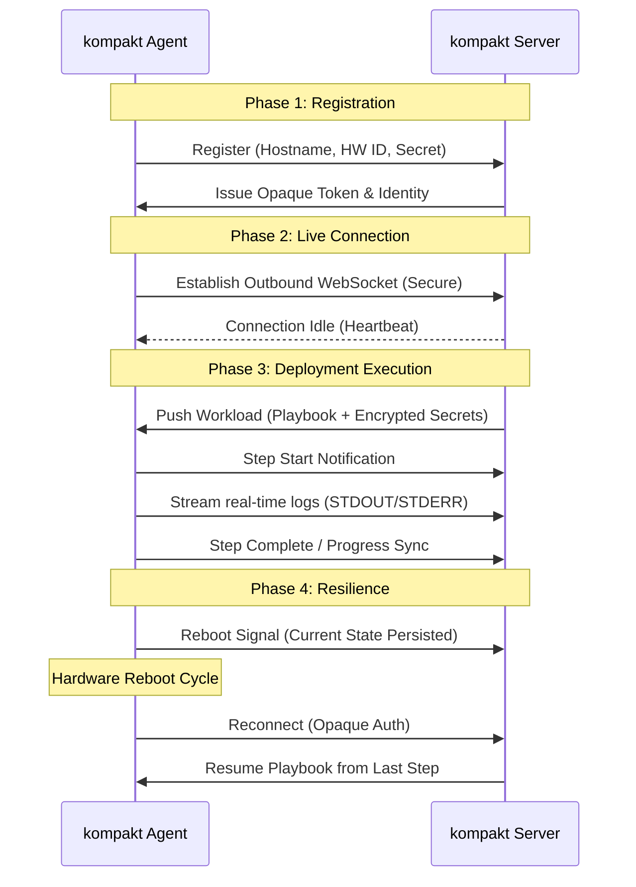

# Kompakt

**Deploy to any node. Survive any reboot.**

Kompakt is a resilient, agent-based deployment automation tool designed for on-premises, bare-metal, and edge environments. It ensures that complex multi-step deployments complete reliably, even across hardware reboots and network outages.

---

## Why Kompakt?

Traditional orchestration struggles at the “last mile.” Kompakt changes that:

- **No more KVM headaches**: Skip slow consoles and manual passwords.
- **Edge-ready**: Deploy anywhere, even without PXE, vaults, or artifact stores.
- **Multi-Stage Provisioning**: Orchestrate complex workflows across reboots, preserving state at every step.
- **Secrets handled securely**: Inject passwords and keys at runtime, never in the OS image.
- **Configurable playbooks & ISOs**: The right recipe for every hardware and OS.

Kompakt brings the full stack to the edge, turning tedious tasks into fast, repeatable processes.

---

## Architecture

---

## Core Features

| Feature | Description |
| :--- | :--- |
| **Tiered Multi-Stage Deployments** | Orchestrate complex workflows from Live CD installation to final OS configuration on first boot or multiple reboots. |
| **Integrated Credential Vault** | Securely manage and inject secrets via `${{ secrets.NAME }}` without ever touching the agent's disk. |
| **Centralized Artifact Storage** | Efficiently distribute binaries and blobs with granular, agent-specific access policies. |
| **Live Remote Command Execution** | Execute ad-hoc commands with real-time feedback for rapid troubleshooting and development. |
| **Centralized Audit Logs** | Stream and store all agent execution logs centrally for a complete, immutable audit trail. |
| **Automated ISO Builder** | Create custom bootable Linux or WinPE media with the Kompakt Agent pre-integrated. |
| **Resilient Reboot Lifecycle** | Survive power cycles and intentional restarts with synchronized state on both server and agent. |
| **Zero External Dependencies** | Statically linked Go binaries with no requirement for Docker, Python, or external runtimes. |

---

## Project Resources

- [Architecture Deep Dive](docs/architecture-deep-dive.md)
- [API Documentation](docs/api-endpoints.md)
- [Playbook Model & Step Types](docs/playbook-model.md)
- [Agent Authentication & Security](docs/agent-authentication.md)
- [Onboarding Guide](docs/onboarding.md)
- [General Documentation](docs/documentation.md)

---

### License
Kompakt is licensed under the [MIT License](LICENSE).
